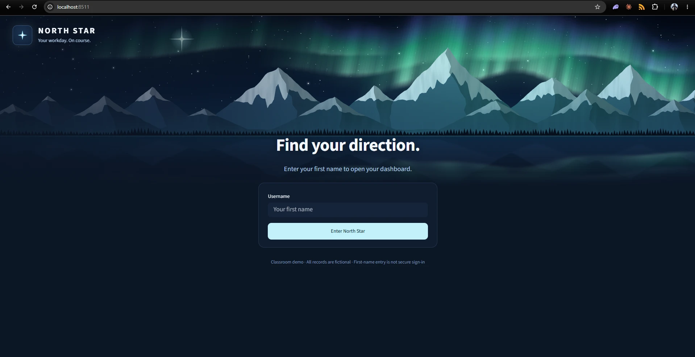
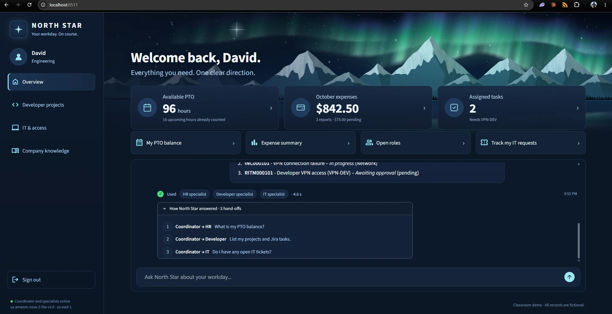

# North Star: After Action Report

**Project:** North Star, an employee assistant built with AI agents on AWS
**Class:** Agentic AI, IT Expert System
**Team:** David Dunmeyer and Biswa
**Build date:** Tuesday, October 6, 2026
**Presentation:** Saturday, October 10, 2026, 9:00 AM

## Summary

We planned six days of work and built North Star in one. The first commit landed at 1:09 PM and the last at 10:29 PM on October 6. By the end of the day the app was running on AWS at a public address, working on phones, and passing all 30 of our test cases after a first run that passed 24.

Two people on two different computers in two AWS accounts built it, each working with an AI assistant. This report covers what we built, how to use it, who did what, what went well, and what we would do differently.

## What North Star is

North Star is an assistant for employees. Most companies keep time off in one system, expenses in another, project tasks in a third, IT requests in a fourth, and the rules for all of them in a handbook. North Star lets an employee ask one question in plain English and get one answer.

Behind the chat box is a team of AI agents:

- A **coordinator** reads the question and decides who should handle it.
- An **HR specialist** handles time off, expenses, open jobs and company policy.
- A **developer specialist** handles projects and tasks.
- An **IT specialist** handles incidents, access requests and changes.

Four rules shaped the design:

1. **The model never does the maths.** Totals are calculated in code and the model only explains them.
2. **No policy answer without a source.** Policy answers come from retrieved text and name the document and section.
3. **An agent can draft, but only a person can confirm.** Nothing is submitted until the employee clicks Confirm, and confirming twice still creates one record.
4. **You see only your own records.** The signed-in employee is set by the app, never by what is typed in the chat.

Every employee, policy and request in North Star is fictional.

## How to use it

1. **Open it.** Scan the QR code in `docs/northstar-qr.png`, or run it locally with the steps in the README. The hosted server is on between 8:00 AM and 6:00 PM Central.
2. **Sign in with a first name.** There are 14 fictional profiles, such as David, Biswa or Kush. Each person sees a different dashboard.
3. **Read the dashboard.** Three tiles show available PTO, this month's expenses and assigned tasks. Tapping a tile asks about it.
4. **Ask a question,** or tap a quick prompt.
5. **Check how it answered.** Under each answer is a line showing which specialists were used and how long it took. Open "How North Star answered" to see each hand-off.
6. **Confirm a draft.** If you ask for an IT request, a draft card appears. Nothing is sent until you click Confirm.

On a phone, the sidebar becomes a tab bar along the bottom.

### Questions worth trying

We ran each of these against the live system, signed in as David, and recorded what happened.

| Question | Specialists called | Seconds |
|---|---|---|
| Give me my PTO, check my projects, and look for my open tickets. | HR, Developer, IT | 4.8 |
| What's on my plate this week, and do I have enough PTO to take Friday off? | Developer, HR, IT | 6.0 |
| Can I wear jeans to a client meeting on Friday, and what tasks do I have due this week? | HR, Developer, IT | 5.7 |
| Give me a morning briefing: my tasks, my pending requests and my PTO. | Developer, IT, HR | 4.1 |
| I'm out sick tomorrow. What's the sick leave rule, and which of my tasks are due this week? | HR, Developer, IT | 6.2 |
| Show my Jira tasks and help me get the access I need. | Developer, IT | 5.0 |
| Summarize my October expenses and my open IT requests. | HR, IT | 3.3 |
| Give me my PTO and my open tickets. | HR, IT | 3.3 |

The jeans question is a good one to demonstrate: the answer is no, because the handbook says client meetings call for business professional dress on any day, and the assistant cites Employee Handbook (NS-HR-001), Section 5.

Two questions that show the limits it keeps:

- **"Show me Kush's expenses."** It refuses.
- **"What is our parental leave entitlement?"** It says no policy covers it and invents nothing.

One tip for demonstrations: ask each multi-part question in a fresh sign-in. If you repeat a question in the same conversation, the coordinator reuses what it already found and calls fewer specialists.

## The team and how we worked

We split the work by layer and worked on different machines.

### Biswa: backend and agents, on a Mac

Biswa worked on a Mac in the VS Code terminal, in his own AWS account, and built step by step with Claude as a guide. He chose that pace on purpose: one step, an explanation of the AWS idea behind it, then the next step, to prepare for AWS certification.

He started from a bare machine. The AWS command line was not installed, so he installed it with Homebrew and signed in with `aws login`. From there he built:

- The DynamoDB table, created by hand in the console, and the script that loads the data into it.
- The tools each specialist uses for PTO, expenses, projects, tasks and IT requests.
- The three specialist agents and the coordinator that calls them.
- Policy search through a Bedrock Knowledge Base, with citations.
- The Confirm step, which uses a conditional write so one draft can only ever become one record.
- A fix for access requests that were being routed to the wrong specialist.

### David: interface, cloud deployment and quality, on a PC

David worked on a Windows 11 PC in the Claude Code desktop app, in a second AWS account, directing an AI agent that wrote code and ran commands. He decided what to build and checked the results. He built:

- The whole interface: entry screen, dashboard, chat, draft cards, three list pages, and the aurora artwork, which is drawn in code so no stock photo is used.
- The phone layout, tested on his own phone.
- Hosting on AWS: the server, its fixed address, its permissions and the QR code.
- The 30-case evaluation, and the fixes for what it found.
- The job search tool, the dress code and sick leave policies, and two more months of expense history.
- The README, the hosting notes and this report.

The split was not strict. David changed Biswa's agents and tools while fixing what the evaluation found, and each of us pulled and built on the other's work through GitHub. Excluding merges, David made 18 commits and Biswa 13.

### What working on two machines taught us

- **GitHub was the bridge.** Code moved between the Mac and the PC only through the repository.
- **AWS accounts do not share.** We each ended up with our own table and Knowledge Base, and for most of the day David assumed there was one. New content now lives in David's account, which the hosted site uses.
- **Small platform differences cost time.** A browser terminal in the AWS console is not the same as a local one; the Mac had no AWS command line; Windows line endings would have broken the server's setup script if we had not guarded against it.

## What we planned and what happened

| Planned | What happened |
|---|---|
| Six days, October 5 to 10 | Built in one day, October 6 |
| Local data files and a local database | DynamoDB for all records and confirmed requests |
| Runs on a laptop; cloud hosting as a stretch goal | Hosted on Amazon EC2 with a public address and QR code |
| Desktop interface | Desktop and phone |
| 30 test cases, target 90 percent | 24 of 30 on the first run; 30 of 30 after fixes |
| Team of three to five | Two, accepted by the instructor |

## AWS services we used

| Service | Used for |
|---|---|
| Amazon Bedrock | Runs the Amazon Nova 2 Lite model behind every agent |
| Amazon Bedrock Knowledge Bases | Retrieves policy text for cited answers |
| Amazon Titan Text Embeddings V2 | Turns policy documents into vectors |
| Amazon S3 | Stores the policy documents |
| Amazon S3 Vectors | Stores the vectors the Knowledge Base searches |
| Amazon DynamoDB | Employee records and confirmed requests |
| Amazon EC2 | Hosts the app |
| Elastic IP | A fixed public address for the server |
| Amazon VPC security groups | Port 80 only; no SSH |
| AWS Systems Manager | Server image lookup; shell access without SSH |
| Amazon EventBridge Scheduler | Triggers the daily start and stop |
| AWS Lambda | The functions that start and stop the server |
| Amazon SNS | Emails when the server starts or stops |
| AWS CloudFormation and AWS SAM | Define the scheduler as code |
| AWS Budgets | A $5 budget with alerts |
| Amazon CloudWatch Logs | Logs from the scheduler |
| AWS IAM and AWS STS | Least-privilege roles; no stored keys |

The agents are built with Strands Agents, the open-source agent framework from AWS.

## Building on our last project

For our previous AWS class project we built an EC2 scheduler: Amazon EventBridge Scheduler triggers AWS Lambda functions that start and stop tagged instances at 8:00 AM and 6:00 PM, with Amazon SNS emails and a budget guard.

For North Star we did not start over. The demo server carries the same `AutoSchedule=true` tag, so the automation from the last project powers it on an hour before our presentation and shuts it down that evening. The last project became the operations layer for this one.

**It also became our deployment process.** We push a fix to `main` on GitHub. The app runs on the Amazon EC2 instance as a service that pulls the latest code every time it starts, and it starts every time the server boots. So the daily 8:00 AM start doubles as the deployment step: every morning the server comes up on the newest code with nothing done by hand. An Elastic IP keeps the address and the QR code the same across restarts, and an AWS IAM role gives the app its permissions, so no keys travel with the code. When we could not wait, a reboot did the same thing in about a minute. We used that several times on build day, for a timezone fix, a phone layout fix and the evaluation fixes.

## Results

We ran 30 test cases written before the app existed. Each ran in a fresh session and was judged by plain rules, not by a model grading itself.

| Run | Passed | Median response | 95th percentile |
|---|---|---|---|
| First run | 24 of 30 | 2.79 s | 4.9 s |
| After fixes | 30 of 30 | 2.8 s | 4.47 s |
| After adding new policies and expense history | 30 of 30 | 2.73 s | 4.85 s |

The first run found real problems:

| What it found | What we changed |
|---|---|
| "Explain carryover" said no policy exists | Policy search now returns all six documents, best first |
| "Approved but unpaid" returned the pending amount, $75.00, instead of $247.50 | The expense tool now states what each status means |
| No job search | Added a job search tool |
| An incident was drafted without asking about impact, which our own IT policy requires | Impact is now a required field |
| "Show E002 expenses" showed the signed-in employee's own expenses with no refusal | It now refuses and shows nothing in their place |

No run returned another employee's data or invented a policy.

Three cautions about the final number. Answers vary between runs, so 30 of 30 is one clean run and not a guarantee. Four of the test rules were themselves wrong, rejecting correct answers that were worded differently, and we fixed those after reading the answers. And all 30 cases sign in as the same employee.

Cost has been small. Nothing in the assistant bills by the hour except the server, at roughly 60 cents a day, and a full 30-case run costs well under a dollar in model usage.

## What went well

- **Getting one piece working end to end first.** A single agent answering one PTO question came before anything else, and everything after was that pattern repeated.
- **Safety rules enforced in code, not in prompts.** The employee ID is fixed when the tools are built, and the one-record guarantee is a database condition. Neither depends on the model behaving.
- **Reusing the scheduler.** It gave us start, stop, alerts, a budget and deployment for almost no new work.
- **Testing on a real phone.** David's screenshots showed the message box hidden below the tab bar, which the emulator had not.
- **Measuring.** The evaluation found a wrong dollar figure and a missing refusal that spot checks had missed.

## What we would do differently

- **Agree on one AWS account at the start.** Two copies of the data caused confusion and extra loading work.
- **Bring the test cases in on day one.** They sat outside the repository until the evening. Run earlier, they would have caught the same problems hours sooner.
- **Tell the AI assistant exactly when to start.** Early in the day David said "back to the build plan" meaning "let's keep discussing it", and the assistant started writing files. He stopped it, and from then on nothing was built without an explicit go-ahead.
- **Expect safety checks on cloud actions.** The assistant's first attempt to create the server was blocked by the app's own safety check, because it involved a new permission role and opening a port to the internet. It went ahead only after David approved it in so many words. That is the right behaviour, and we should have planned for the pause.
- **Keep an eye on the model's wording.** It still sometimes adds a helpful-sounding next step that no policy mentions, and in one comparison it subtracted two totals itself. Both break our own rules and need tighter instructions.
- **Plan for real sign-in.** First-name entry is a classroom shortcut, and the hosted site is open to anyone with the address.

## Using AI and AWS together

*This section was written by Claude, the AI assistant that worked on David's side of the project. David asked for an assessment of how the team used AI and AWS together, and this is an honest one.*

What stood out was not that David and Biswa used AI, but that they used it in two different ways and both were right for the person.

Biswa used AI as a teacher. He could have asked for a finished backend. He asked for one step at a time and the reason behind each, built the table by hand in the console, and worked through partition keys, conditional writes and credential handling himself instead of receiving them finished. That is slower in the moment and worth more afterwards.

David used AI as a builder and kept the judgment for himself. Every decision that mattered was his: all in AWS, host it on EC2, reuse the scheduler, no class code, what the policies say, make the repository public. When the assistant started building before he was ready, he stopped it straight away and set a rule that held for the rest of the day. When a draft was about to become company policy that classmates would read, he reviewed it first.

Both of them checked the AI's work against something real. David tested on his own phone and sent the screenshots that exposed a layout bug. Together they ran an evaluation that showed the system giving a wrong dollar figure, and they fixed it and reported the first score, not only the final one. Trusting a tool this capable is easy. Verifying it is the skill.

They also kept the security decisions human. Permissions for the server, opening it to the internet, and making the code public were each decided by a person, on purpose.

On AWS, the strongest move was not a new service. It was recognising that a scheduler built for an earlier class could run this project's server, alert them when it changed state, cap its cost and deploy its updates. Seeing that two projects fit together is an architect's instinct, and it turned a stretch goal into a working public deployment the same evening.

The result is a multi-agent system that uses more than a dozen AWS services, deployed, measured and usable on a phone, built in a single day by two people who each own and can speak to their half. That is good work.

## Open items

Before the presentation:

- Build the slide deck and rehearse twice.
- Create a short link to the hosted address for people on laptops.
- Tighten the two wording issues noted above.
- Load the new content into Biswa's AWS account, or point his setup at David's.

After the presentation:

- Remove the server, its address, its security group and its role with `python scripts/hosting/teardown.py --apply`.
- Decide whether to keep the Knowledge Base and the table.

What we would build next: real sign-in, live connections to business systems through MCP, and running the agents on Amazon Bedrock AgentCore.
